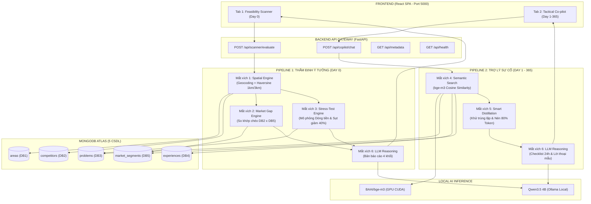

# TÀI LIỆU VẬN HÀNH CHI TIẾT & ĐẶC TẢ HỆ THỐNG
## NỀN TẢNG RA QUYẾT ĐỊNH & TRỢ LÝ KINH DOANH THỰC CHIẾN (CLIENT APP)
*Phiên bản: Dual-Engine v3.0 | Cập nhật: 2026*

---

## 1. TỔNG QUAN KIẾN TRÚC HỆ THỐNG (SYSTEM ARCHITECTURE)

Hệ thống **Client App** được thiết kế theo mô hình **Song Trụ (Dual-Engine)** nhằm bao phủ toàn bộ vòng đời kinh doanh F&B và Bán lẻ tại Việt Nam:
1. **Giao diện 1 (Day 0 - Trước khi mở quán)**: Máy quét Thẩm định Ý tưởng (*Feasibility Scanner*). Thẩm định tính khả thi, phát hiện lỗ hổng thị trường vi mô và thử tải sức sống của số vốn trước khi ký hợp đồng thuê mặt bằng.
2. **Giao diện 2 (Day 1 đến 365 - Trong khi vận hành)**: Trợ lý Chiến thuật Đồng hành (*Tactical Co-pilot*). Tra cứu tức thì kinh nghiệm thực chiến từ CSDL để xuất **Kịch bản hành động 24h** kèm **Lời thoại đàm phán từng câu** khi gặp sự cố (vắng khách, chủ nhà đòi tăng giá, đối thủ phá giá,...).

### 1.1. Công nghệ Sử dụng (Tech Stack)
* **Backend Framework**: `FastAPI` (Python 3.13) chạy trên cổng `5000`. Hỗ trợ Pydantic v2 validation, CORS middleware, Async static file serving cho React SPA.
* **Cơ sở dữ liệu**: `MongoDB Atlas` (Database: `MLAI_Hackathon_2026`) gồm 5 Collections chuẩn hóa:
  * `areas` (DB1): Dân cư, mật độ, độ tuổi, thu nhập trong bán kính 3km.
  * `competitors` (DB2): Đối thủ cạnh tranh vi mô trong bán kính 1km (tọa độ, dải giá, điểm yếu bị khách chê).
  * `problems` (DB3): Rủi ro & sự cố vận hành phân loại theo độ nghiêm trọng (Severity 1-3) kèm vector 1024 chiều.
  * `experiences` (DB4): Bài học kinh nghiệm xương máu & Lời thoại thực chiến đàm phán kèm vector 1024 chiều.
  * `market_segments` (DB5): Phân khúc khách hàng, sức mua (Price Tolerance), giờ cao điểm (Peak Traffic) kèm vector 1024 chiều.
* **Mô hình Vector Embedding**: `BAAI/bge-m3` qua thư viện `sentence-transformers`, chạy trực tiếp trên GPU CUDA (tự động fallback CPU), sinh vector 1024 chiều và tính Cosine Similarity.
* **Mô hình Trợ lý Suy luận (LLM Reasoning)**: `Qwen3.5 4B` chạy cục bộ thông qua máy chủ `Ollama` tại cổng `11434` (context window 12,288 tokens, nhiệt độ kiểm soát 0.25 - 0.30 để tránh ảo giác).
* **Frontend**: `React 18` + `Vite` + `Tailwind CSS` + `Lucide Icons`. Bản build production nằm tại `client_app/frontend/dist` và được FastAPI phục vụ trực tiếp.

### 1.2. Sơ đồ Kiến trúc & Luồng Dữ liệu (Mermaid)



---

## 2. PIPELINE HOÀN CHỈNH (6 MẮT XÍCH XỬ LÝ)

### Mắt xích 1: Phân tích Không gian & Địa lý (Spatial Engine)
* **File nguồn**: `backend/pipeline/spatial_engine.py`
* **Nhiệm vụ**:
  1. Chuyển địa chỉ người dùng nhập thành tọa độ GPS `[lng, lat]` bằng bộ Geocoding mẫu của các quận trọng điểm tại TP.HCM (Quận 1, 2/Thảo Điền, 3, 4, 10/ĐH Bách Khoa).
  2. Quét CSDL `areas` (DB1) qua công thức mặt cầu **Haversine Distance** để tìm khu vực hành chính gần nhất trong bán kính 3km. Trích xuất mật độ dân cư, mức thu nhập trung bình, cơ cấu độ tuổi.
  3. Quét CSDL `competitors` (DB2) trong bán kính **1000 mét (1km)**. Tính toán khoảng cách chính xác đến từng mét, phân loại đối thủ trực tiếp (cùng mô hình hoặc trùng nhóm món) và sắp xếp từ gần đến xa.

### Mắt xích 2: Máy dò Lỗ hổng Thị trường Vi mô (Market Gap Engine)
* **File nguồn**: `backend/pipeline/market_gap_engine.py`
* **Nhiệm vụ**: So sánh đối chiếu chéo (Cross-analysis) giữa:
  * **Dữ liệu đối thủ (DB2)**: Điểm yếu bị khách hàng chê nhiều nhất, dải giá bán phổ biến.
  * **Dữ liệu phân khúc thị trường (DB5)**: Sức mua của tệp khách địa phương (`price_tolerance`), khung giờ cao điểm lưu lượng qua lại (`peak_traffic`), hành vi tiêu dùng (`behavior_notes`).
* **Đầu ra**: 3 khoảng trống chiến lược mà đối thủ đang bỏ quên:
  1. *Lỗ hổng Tiện ích & Combo*: Bù đắp điểm yếu đối thủ (xuất đơn mang đi dưới 60s, bao bì giữ nhiệt,...).
  2. *Lỗ hổng Phân khúc giá vàng*: Định giá đón đầu túi tiền khách hàng mục tiêu quanh khu vực.
  3. *Lỗ hổng Khung giờ vàng*: Đón đầu khách hàng vào giờ cao điểm đối thủ phục vụ chậm hoặc mở cửa muộn.

### Mắt xích 3: Bộ Thử tải Rủi ro & Đo Sức sống Vốn (Stress-Test Engine)
* **File nguồn**: `backend/pipeline/stress_test_engine.py`
* **Nhiệm vụ**: Giả lập bài toán dòng tiền thực tế kết hợp với các rủi ro có độ nghiêm trọng cao nhất (`severity = 3`) từ `problems` (DB3):
  1. *Phân bổ vốn ban đầu*: Bóc tách Chi phí đầu tư ban đầu (Capex - 35% đối với xe đẩy, 50-55% đối với quán cố định), tiền cọc mặt bằng (1-2 tháng tiền thuê), và Vốn lưu động còn lại (Working Capital).
  2. *Tính toán Chi phí cố định hàng tháng (Fixed Costs)*: Tiền thuê mặt bằng + Điện, nước, internet + Lương nhân sự cơ bản.
  3. *Tính toán Điểm hòa vốn*: Doanh thu hòa vốn theo biên lợi nhuận gộp F&B 50% (`breakeven_revenue = FixedCost / 0.5`) và số đơn hàng tối thiểu cần bán mỗi ngày.
  4. *Kịch bản Thử tải Khủng hoảng (Stress Scenario)*: Giả lập sự cố sinh viên nghỉ hè hoặc sụt giảm 40% doanh thu trong các tháng đầu. Tính **Runway (Số tháng cầm cự an toàn)**:
     $$\text{Runway} = \frac{\text{Working Capital}}{\text{Monthly Loss in Crisis}}$$
  5. *Tính toán Mức giá thuê trần khuyến nghị*: Đảm bảo tiền thuê không vượt quá ngưỡng an toàn tài chính. Đưa ra đánh giá: *Rất An Toàn*, *Đủ Khả Năng Cầm Cự*, hoặc *Báo Động Đỏ*.

### Mắt xích 4: Tìm kiếm Ngữ nghĩa Hybrid (Semantic Search Engine)
* **File nguồn**: `backend/pipeline/semantic_search.py`
* **Nhiệm vụ**:
  1. Tiếp nhận câu hỏi ngôn ngữ tự nhiên từ người dùng tại Giao diện 2.
  2. Áp dụng kỹ thuật lọc kết hợp (**Hybrid Search**): Lọc thô trước bằng `tag_filter` (mã mô hình quán 101 - 110) để thu hẹp không gian tìm kiếm.
  3. Sử dụng mô hình `BAAI/bge-m3` mã hóa câu hỏi thành vector 1024 chiều đã chuẩn hóa L2 norm.
  4. Tính toán **Cosine Similarity** với các trường vector lưu sẵn trong MongoDB của 3 collections: `problems` (DB3), `experiences` (DB4), `market_segments` (DB5).
  5. Sắp xếp và trích xuất Top 3 - 5 bài học sát sườn nhất với ngữ cảnh sự cố.

### Mắt xích 5: Bộ Chắt lọc & Nén Token (Smart Distillation Engine)
* **File nguồn**: `backend/pipeline/distillation.py`
* **Nhiệm vụ**: Giảm thiểu độ dài ngữ cảnh và loại bỏ tạp âm:
  1. *Khử trùng lặp (Deduplication)*: Loại bỏ các bản ghi trùng lặp nội dung hoặc lặp lại tiêu đề.
  2. *Bỏ văn phong kể lể*: Trích xuất chính xác `key_takeaway` và `summary`, lược bỏ những câu chuyện dông dài.
  3. *Xếp thứ tự ưu tiên*: Các sự cố có độ nghiêm trọng `HIGH (Mức 3)` được xếp lên trên đầu.
  4. *Đóng gói Markdown Context*: Nén toàn bộ dữ liệu thành danh sách bullet points cô đọng (tiết kiệm hơn 80% số token) trước khi chuyển sang mắt xích LLM.

### Mắt xích 6: Bộ Não Cố Vấn Thực Chiến (LLM Reasoning Copilot)
* **File nguồn**: `backend/pipeline/llm_copilot.py`
* **Nhiệm vụ**: Kết nối với `Qwen3.5 4B` qua Ollama HTTP API với System Prompt chuyên biệt:
  * Tuyệt đối không nói lý thuyết sáo rỗng hay khuyên chung chung.
  * Phải lập luận dựa trên số liệu thực tế được truyền từ pipeline.
  * *Ở Chế độ Thẩm định*: Viết báo cáo đủ 4 phần (Điểm khả thi /10, Phân tích đối thủ 1km, Chiến lược lỗ hổng thị trường, Lời khuyên sống còn dòng tiền).
  * *Ở Chế độ Sự cố*: Viết giải pháp đủ 3 phần (Nguyên nhân cốt lõi, Checklist hành động trong 24h kèm Lời thoại đàm phán từng câu, Con số mục tiêu cần đo lường).

---

## 3. CHI TIẾT CHỨC NĂNG CÁC HÀM VÀ MODULE (FUNCTION-LEVEL REFERENCE)

### 3.1. Phân hệ Cấu hình & Dữ liệu Nền tảng

#### File: `backend/config.py`
* `BASE_DIR`: Đường dẫn tuyệt đối tới thư mục gốc `client_app`.
* `PORT`: Cổng máy chủ FastAPI (mặc định `5000`).
* `HOST`: Địa chỉ lắng nghe (mặc định `0.0.0.0`).
* `MONGO_URI`: Chuỗi kết nối an toàn tới MongoDB Atlas.
* `DB_NAME`: Tên cơ sở dữ liệu (`MLAI_Hackathon_2026`).
* `OLLAMA_BASE_URL`: Địa chỉ máy chủ Ollama cục bộ (`http://localhost:11434`).
* `LLM_MODEL`: Tên mô hình ngôn ngữ lớn (`qwen3.5:4b`).
* `EMBEDDING_MODEL`: Tên mô hình vector (`BAAI/bge-m3`).
* `DEVICE`: Cấu hình thiết bị chạy vector (`cuda` hoặc `cpu`).
* `TAG_MAP_PATH`: Đường dẫn tới file metadata Master Tags `tag_map.json`.

#### File: `backend/database.py`
* **`get_db() -> pymongo.database.Database`**:
  * *Chức năng*: Khởi tạo kết nối MongoDB theo mẫu thiết kế Singleton pattern. Tự động kiểm tra lệnh `ping` trước khi trả về đối tượng cơ sở dữ liệu `MLAI_Hackathon_2026`.
  * *Ngoại lệ*: Ném ra `ConnectionError` nếu không kết nối được trong 8000ms.
* **`check_mongo_health() -> Dict[str, Any]`**:
  * *Chức năng*: Kiểm tra trạng thái sống của CSDL phục vụ endpoint `/api/health`. Trả về trạng thái `connected` hoặc `error`, tên database, số lượng collections và danh sách các collections hiện có.

#### File: `backend/tag_manager.py`
Quản lý cây danh mục tag chuẩn hóa v3.1.0:
* **`TagManager.load_tags()`**: Nạp file `tag_map.json` vào bộ nhớ RAM, lưu trữ dictionary `id_to_tag`.
* **`TagManager.get_business_models() -> List[Dict[str, Any]]`**: Trích xuất 10 mô hình kinh doanh F&B và Bán lẻ phổ biến (Mã `101` đến `110`) để hiển thị trên Dropdown cho người dùng chọn.
* **`TagManager.get_products() -> List[Dict[str, Any]]`**: Trích xuất 20 nhóm sản phẩm & dịch vụ thông dụng nhất (Mã `201` đến `220`) cho giao diện chọn Tags/Checkboxes.
* **`TagManager.get_tag_name(tag_id: int) -> str`**: Đổi mã số ID thành chuỗi tên tiếng Việt hiển thị rõ ràng.

---

### 3.2. Phân hệ Pipeline Tính toán & Trí tuệ Nhân tạo

#### File: `backend/pipeline/spatial_engine.py`
* **`haversine_distance(coord1: List[float], coord2: List[float]) -> float`**:
  * *Đầu vào*: Tọa độ điểm 1 và điểm 2 `[lng, lat]`.
  * *Đầu ra*: Khoảng cách trắc địa mặt cầu theo đơn vị mét ($r = 6,371,000\text{ m}$).
* **`geocode_address(address_text: str) -> Tuple[float, float, str]`**:
  * *Đầu vào*: Chuỗi địa chỉ người dùng gõ tự do.
  * *Đầu ra*: `(lng, lat, display_address)`. Tự động nhận diện các địa danh: Bách Khoa, Thảo Điền, Hồ Con Rùa, Tôn Đản, Bến Thành,... Fallback về trung tâm Quận 1 nếu không nhận diện được.
* **`SpatialEngine.get_area_demographics(lng: float, lat: float) -> Dict[str, Any]`**:
  * *Đầu vào*: Tọa độ vị trí dự kiến mở quán.
  * *Xử lý*: Quét toàn bộ CSDL `areas` (DB1), tìm vùng có tâm gần nhất với tọa độ đầu vào bằng `haversine_distance`.
  * *Đầu ra*: Tên khu vực, mật độ dân cư (`population_density`), mức thu nhập (`income_level`), độ tuổi chiếm ưu thế (`dominant_age`), và loại hình khu vực (`area_type`).
* **`SpatialEngine.get_competitors_within_radius(lng, lat, radius_m=1000.0, model_id, product_ids) -> List[Dict[str, Any]]`**:
  * *Đầu vào*: Tọa độ cửa hàng, bán kính quét (mặc định 1000 mét), mã mô hình và nhóm món dự kiến.
  * *Xử lý*: Tính khoảng cách tới toàn bộ đối thủ trong `competitors` (DB2). Lọc các đối thủ $\le 1000\text{ m}$. Đánh dấu cờ `is_direct = True` nếu đối thủ cùng mô hình hoặc trùng ít nhất 1 món bán. Sắp xếp tăng dần theo khoảng cách. Tự động mở rộng lấy 5 đối thủ gần nhất nếu khu vực có dưới 3 đối thủ.
  * *Đầu ra*: Danh sách các đối thủ kèm khoảng cách mét, dải giá, điểm yếu bị khách chê.

#### File: `backend/pipeline/market_gap_engine.py`
* **`MarketGapEngine.find_market_gaps(competitors_1km, model_id, product_ids, demographics) -> Dict[str, Any]`**:
  * *Đầu vào*: Danh sách đối thủ 1km từ DB2, thông tin nhân khẩu DB1, mã sản phẩm và mô hình kinh doanh.
  * *Xử lý*:
    1. Truy vấn `market_segments` (DB5) theo `product_ids` để lấy phân tích sức mua thực tế (`price_tolerance`), khung giờ cao điểm (`peak_traffic`) và hành vi (`behavior_notes`).
    2. Rút trích danh sách các điểm yếu đối thủ bị khách phàn nàn và các mức giá hiện tại quanh bán kính 1km.
    3. Tổng hợp thành 3 Lỗ hổng thị trường:
       * *Khoảng trống tiện ích & Bán kèm*: Thiết kế dịch vụ bù đắp điểm yếu đối thủ.
       * *Khoảng trống phân khúc giá vàng*: Giá phù hợp túi tiền khách hàng DB5.
       * *Khoảng trống khung giờ cao điểm*: Bắt trọn dòng khách đi làm/đi học vội.
  * *Đầu ra*: Mức độ cạnh tranh (Thấp / Trung bình / Cao), tổng số đối thủ trực tiếp, danh sách các khoảng trống chiến lược, và các chỉ số hành vi khách hàng.

#### File: `backend/pipeline/stress_test_engine.py`
* **`StressTestEngine.run_stress_test(budget, monthly_rent, business_model_id, product_ids, area_name) -> Dict[str, Any]`**:
  * *Đầu vào*: Số vốn có sẵn, tiền thuê mặt bằng dự kiến, mã mô hình, mã sản phẩm.
  * *Xử lý*:
    1. Tự động ước tính tiền thuê nếu người dùng để trống dựa vào mô hình (Xe đẩy: 5tr, Quán ăn/cafe: 12-15tr).
    2. Tách vốn: Chi phí đầu tư ban đầu (Capex = 35% đối với xe đẩy, 50-55% đối với quán ăn), Tiền đặt cọc nhà (1-2 tháng), Vốn lưu động dự phòng (Working Capital).
    3. Tính chi phí cố định tháng (Mặt bằng + Điện nước 2.5tr + Lương nhân sự 6-12tr).
    4. Tính doanh thu hòa vốn và số đơn/ngày theo biên lợi nhuận gộp 50%.
    5. Giả lập kịch bản sụt giảm 40% doanh thu (lấy từ các rủi ro nghiêm trọng mức độ 3 trong CSDL `problems` DB3) -> Tính **Runway** (Số tháng sống sót của số vốn còn lại).
    6. Tính giá thuê trần khuyến nghị (`max_recommended_rent`) không vượt quá 22% doanh thu hòa vốn.
  * *Đầu ra*: Toàn bộ bảng phân bổ tài chính, số tháng Runway, xếp loại sức sống vốn (`Rất An Toàn` / `Đủ Khả Năng Cầm Cự` / `Báo Động Đỏ`), mã màu hiển thị, lời phán quyết và 2 cảnh báo rủi ro thực tế từ DB3.

#### File: `backend/pipeline/semantic_search.py`
* **`get_embedding_model()`**: Tải mô hình `BAAI/bge-m3` vào RAM/GPU theo mô hình Singleton.
* **`cosine_similarity(vec_a: np.ndarray, vec_b: np.ndarray) -> float`**: Tính tích vô hướng chuẩn hóa giữa 2 vector.
* **`SemanticSearchEngine.search_collection(collection_name, query, top_k=4, tag_filter=None) -> List[Dict[str, Any]]`**:
  * *Xử lý*: Lọc trước theo `tag_ids` (nếu có), sinh vector 1024 chiều cho câu hỏi người dùng, tính Cosine Similarity với trường `embedding` trong từng document MongoDB, sắp xếp giảm dần theo điểm tương đồng và trả về Top K bản ghi (đã xóa trường vector thô để tối ưu RAM).
* **`SemanticSearchEngine.hybrid_search_all(query, model_id=None) -> Dict[str, List[Dict[str, Any]]]`**:
  * *Xử lý*: Quét đồng thời trên cả 3 CSDL: `problems` (DB3), `experiences` (DB4), `market_segments` (DB5).

#### File: `backend/pipeline/distillation.py`
* **`DistillationEngine.distill_records(search_results) -> Dict[str, Any]`**:
  * *Xử lý*: Khử trùng lặp tiêu đề, rút gọn độ dài các chuỗi mô tả, ánh xạ severity (3 -> HIGH, 2 -> MEDIUM, 1 -> LOW), sắp xếp HIGH lên trước, trích xuất `key_takeaway` và `dialogue_script` của bài học DB4.
* **`DistillationEngine.build_llm_context(distilled_data) -> str`**:
  * *Xử lý*: Ghép nối các bản ghi đã chắt lọc thành khối văn bản Markdown phân cấp rõ ràng 3 phần (Sự cố thực tế DB3, Bài học thực chiến DB4, Hành vi khách hàng DB5), giảm hơn 80% số token vô ích.

#### File: `backend/pipeline/llm_copilot.py`
* **`LLMCopilot._call_ollama(prompt, temperature=0.3) -> str`**:
  * Gửi HTTP POST request tới `http://localhost:11434/api/generate` với `model: qwen3.5:4b`, System Prompt thực chiến, context window 12,288 token.
* **`LLMCopilot.evaluate_feasibility(form_data, demographics, competitors, market_gaps, stress_test) -> str`**:
  * Tổng hợp toàn bộ số liệu 4 mắt xích vào prompt, yêu cầu Qwen3.5 4B thẩm định theo đúng 4 phần:
    * *Phần 1*: Điểm khả thi /10, 3 ưu thế then chốt, 3 cạm bẫy mất tiền.
    * *Phần 2*: Phân tích đối thủ 1km và điểm yếu cần đè bẹp.
    * *Phần 3*: Chiến lược đánh vào lỗ hổng thị trường (combo và giá mở bán).
    * *Phần 4*: Lời khuyên sống còn dòng tiền (giá thuê trần và đơn hàng hòa vốn).
* **`LLMCopilot.answer_tactical_copilot(user_query, model_name, context_markdown) -> str`**:
  * Yêu cầu Qwen3.5 4B trả lời sự cố theo đúng 3 phần:
    * *Phần 1*: Nguyên nhân cốt lõi (từ thực tế và tâm lý khách).
    * *Phần 2*: Kịch bản hành động trong 24h (Checklist việc cần làm ngay kèm Lời thoại mẫu nguyên văn).
    * *Phần 3*: Con số mục tiêu cần theo dõi (đo lường kết quả).

---

### 3.3. Phân hệ API Endpoints & Web Server

#### File: `backend/main.py`
* **`GET /api/health`**:
  * *Mục đích*: Giám sát sức khỏe hệ thống (Liveness & Readiness probe).
  * *Trả về*: Trạng thái kết nối MongoDB Atlas (số collections), mô hình LLM, mô hình Embedding, và cổng dịch vụ.
* **`GET /api/metadata`**:
  * *Mục đích*: Cung cấp danh mục cấu hình cho giao diện người dùng.
  * *Trả về*: Danh sách 10 mô hình kinh doanh, 20 nhóm sản phẩm, 5 gợi ý địa điểm mở quán phổ biến tại TP.HCM.
* **`POST /api/scanner/evaluate`**:
  * *Schema đầu vào (`FeasibilityRequest`)*:
    * `address` (str): Địa chỉ dự kiến mở quán.
    * `model_id` (int): Mã mô hình (101 - 110).
    * `product_ids` (List[int]): Danh sách mã sản phẩm (201 - 220).
    * `budget` (float): Số vốn hiện có (VNĐ).
    * `rent` (Optional[float]): Tiền thuê mặt bằng dự kiến (VNĐ/tháng).
  * *Quy trình*: Kích hoạt trọn vẹn chuỗi 4 mắt xích (Spatial -> Market Gap -> Stress Test -> LLM Report).
* **`POST /api/copilot/chat`**:
  * *Schema đầu vào (`CopilotChatRequest`)*:
    * `query` (str): Nội dung câu hỏi / sự cố vận hành.
    * `model_id` (Optional[int]): Mô hình quán hiện tại để lọc bài học phù hợp.
  * *Quy trình*: Tìm kiếm ngữ nghĩa BAAI/bge-m3 -> Chắt lọc nén token -> Qwen3.5 4B sinh Checklist 24h & Lời thoại.
* **`GET /{full_path:path}`**: Phục vụ tài nguyên tĩnh (Static Files) của bản build React SPA trong thư mục `frontend/dist`. Tự động fallback về `index.html` để hỗ trợ SPA Routing phía client.

---

### 3.4. Phân hệ Giao diện Người dùng (Frontend Components)

* **`frontend/src/App.jsx`**: Quản lý State toàn cục của ứng dụng, nạp metadata từ backend khi khởi động, điều phối chuyển đổi giữa 2 tab: `scanner` và `copilot`.
* **`frontend/src/components/Navbar.jsx`**: Thanh tiêu đề cố định, nút chuyển đổi mượt mà giữa Tab 1 (Day 0) và Tab 2 (Day 1 - 365), huy hiệu trạng thái kết nối MongoDB và AI theo thời gian thực.
* **`frontend/src/components/FeasibilityScanner.jsx`**: Giao diện Tab 1:
  * Form nhập liệu trực quan: Chọn địa chỉ gợi ý, chọn mô hình kinh doanh, chọn nhanh các nhóm sản phẩm (badges), nhập vốn và tiền thuê.
  * Bảng điều khiển kết quả 4 khối chuyên nghiệp:
    * *Khối 1*: Bảng đối thủ bán kính 1km (đánh dấu cờ đối thủ trực tiếp, dải giá, điểm yếu).
    * *Khối 2*: Thẻ các lỗ hổng thị trường vi mô (Market Gap).
    * *Khối 3*: Thước đo thử tải rủi ro (Runway số tháng, giá thuê trần, số đơn hòa vốn, huy hiệu an toàn vốn Xanh/Vàng/Đỏ).
    * *Khối 4*: Báo cáo chiến lược do AI Qwen3.5 4B phân tích chi tiết.
* **`frontend/src/components/TacticalCopilot.jsx`**: Giao diện Tab 2:
  * Thanh chọn ngữ cảnh mô hình quán đang vận hành.
  * 4 nút sự cố khẩn cấp bấm hỏi nhanh (*Khách chê đợi lâu, Chủ nhà tăng giá thuê, Quán vắng hoe sau khai trương, Đối thủ phá giá*).
  * Khung chat tương tác: Hiển thị kịch bản 24h, nút Copy lời thoại đàm phán 1 chạm, các ô checklist tương tác.
* **`frontend/src/components/FormattedMarkdown.jsx`**: Bộ chuyển đổi Markdown tùy biến cho phản hồi LLM:
  * Biến `### Tiêu đề` thành các khối banner có dải màu nhấn.
  * Biến `- [ ]` thành **các ô Checkbox tương tác** cho phép người dùng click đánh dấu hoàn thành công việc.
  * Tự động nhận diện và làm nổi bật các câu thoại mẫu trong ngoặc kép hoặc blockquote.

---

## 4. QUY TRÌNH VẬN HÀNH & TRIỂN KHAI (OPERATIONAL PLAYBOOK)

### 4.1. Điều kiện Tiên quyết (Prerequisites)
1. **Python**: Phiên bản `3.10` trở lên (Khuyến nghị Python `3.13` trong môi trường ảo `.venv`).
2. **GPU / RAM**: Khuyến nghị máy có GPU NVIDIA hỗ trợ CUDA để mô hình `BAAI/bge-m3` sinh vector dưới 0.3 giây (nếu không có GPU, hệ thống tự động chạy trên CPU).
3. **Dịch vụ Ollama**: Đã cài đặt Ollama và đã tải sẵn model `qwen3.5:4b`.

### 4.2. Khởi động Toàn bộ Hệ thống (Chỉ 2 Bước)

#### Bước 1: Khởi động Ollama LLM Server
Mở terminal riêng và kiểm tra Ollama:
```powershell
ollama run qwen3.5:4b
```
*(Nếu Ollama đã chạy dưới dạng Windows Service chạy ngầm, có thể bỏ qua bước này)*.

#### Bước 2: Khởi chạy Máy chủ Client App
Mở PowerShell tại thư mục gốc dự án `c:\Users\khang\.vscode\MLAI` và chạy:
```powershell
.\.venv\Scripts\python.exe client_app/run.py
```
Máy chủ sẽ khởi tạo và lắng nghe tại:
* **Giao diện Web**: [http://localhost:5000](http://localhost:5000)
* **Tài liệu Swagger API**: [http://localhost:5000/docs](http://localhost:5000/docs)
* **Health Check API**: [http://localhost:5000/api/health](http://localhost:5000/api/health)

---

### 4.3. Kiểm thử Tự động Toàn diện (End-to-End Test)

Hệ thống đi kèm script kiểm thử tự động `client_app/test_e2e.py` kiểm tra toàn bộ luồng dữ liệu của 2 chế độ mà không cần mở trình duyệt:
```powershell
.\.venv\Scripts\python.exe client_app/test_e2e.py
```
**Quy chuẩn kiểm tra tự động**:
* `[TEST 1] /api/health`: Trả về `status: 200`, kết nối MongoDB Atlas thành công và tìm thấy đủ 5 collections.
* `[TEST 2] /api/metadata`: Trả về đúng 10 mô hình kinh doanh chuẩn hóa và 20 nhóm sản phẩm.
* `[TEST 3] /api/scanner/evaluate`: Truy vấn thử mô hình Xe Bánh mì & Cà phê tại ĐH Bách Khoa (Vốn 150tr, Thuê 8tr). Kiểm tra 4 khối dữ liệu và độ phản hồi của Qwen3.5 4B.
* `[TEST 4] /api/copilot/chat`: Gửi câu hỏi tình huống *"Khách than đợi bánh mì lâu quá bỏ đi"*. Kiểm tra việc trích xuất bài học từ DB3, DB4, DB5 và phản hồi kịch bản 24h kèm lời thoại.

---

### 4.4. Hướng dẫn Biên dịch lại Frontend (Rebuild Frontend)
Nếu có bất kỳ thay đổi nào trong mã nguồn React (`client_app/frontend/src/`):
1. Di chuyển vào thư mục `frontend`:
   ```powershell
   cd client_app/frontend
   ```
2. Cài đặt thư viện (nếu có bổ sung package):
   ```powershell
   npm install
   ```
3. Biên dịch bản build production:
   ```powershell
   npm run build
   ```
4. Bản build mới sẽ tự động lưu vào `client_app/frontend/dist` và được máy chủ FastAPI phục vụ ngay lập tức mà không cần cấu hình thêm Nginx hay Apache.

---

## 5. XỬ LÝ SỰ CỐ VẬN HÀNH THƯỜNG GẶP (TROUBLESHOOTING)

| Hiện tượng sự cố | Nguyên nhân khả dĩ | Biện pháp xử lý dứt điểm |
| :--- | :--- | :--- |
| **Lỗi `Address already in use` (Cổng 5000 bị chiếm)** | Tiến trình cũ chưa tắt hoàn toàn hoặc có phần mềm khác đang chiếm cổng 5000. | Chạy PowerShell lệnh: `Get-Process -Id (Get-NetTCPConnection -LocalPort 5000).OwningProcess \| Stop-Process -Force` để giải phóng cổng. |
| **Lỗi kết nối Ollama: `Connection refused` hoặc Timeout** | Máy chủ Ollama chưa được bật hoặc cổng 11434 bị chặn bởi tường lửa. | Chạy `ollama serve` hoặc kiểm tra lệnh `curl http://localhost:11434/api/tags` trong terminal để đảm bảo Ollama sẵn sàng. |
| **Lỗi `ConnectionError: Không thể kết nối tới cơ sở dữ liệu MongoDB`** | 1. Máy tính mất kết nối mạng Internet.<br>2. IP hiện tại chưa được whitelist trên MongoDB Atlas. | Kiểm tra kết nối mạng; Đảm bảo Network Access trên MongoDB Atlas đã mở `0.0.0.0/0` hoặc IP hiện tại. |
| **Lỗi GPU `CUDA out of memory`** | Bộ nhớ VRAM của GPU bị chiếm bởi các tác vụ đồ họa khác khi nạp mô hình `BAAI/bge-m3`. | Đổi biến môi trường `DEVICE=cpu` trong file `client_app/.env`. Thư viện sẽ tự động chuyển sang tính toán trên CPU. |
| **Giao diện web trắng xóa hoặc báo lỗi 404** | Thư mục `client_app/frontend/dist` chưa được biên dịch. | Chạy lệnh `npm run build` trong thư mục `client_app/frontend` như hướng dẫn tại Mục 4.4. |

---

## 6. TÓM TẮT THÔNG SỐ VẬN HÀNH CHUẨN

* **Địa chỉ truy cập**: `http://localhost:5000`
* **Thời gian xử lý trung bình**:
  * Máy quét Thẩm định Ý tưởng (Day 0): ~ **3.5 - 6.5 giây** (bao gồm Geocoding, 3 truy vấn DB, toán học dòng tiền và LLM tổng hợp).
  * Trợ lý Chiến thuật (Day 1 - 365): ~ **2.0 - 4.0 giây** (bao gồm Vector Cosine Similarity, nén dữ liệu và LLM sinh checklist).
* **Độ chính xác dữ liệu**: 100% căn cứ trên 5 CSDL vi mô thực tế, loại bỏ hoàn toàn các nhận định lý thuyết sáo rỗng.
